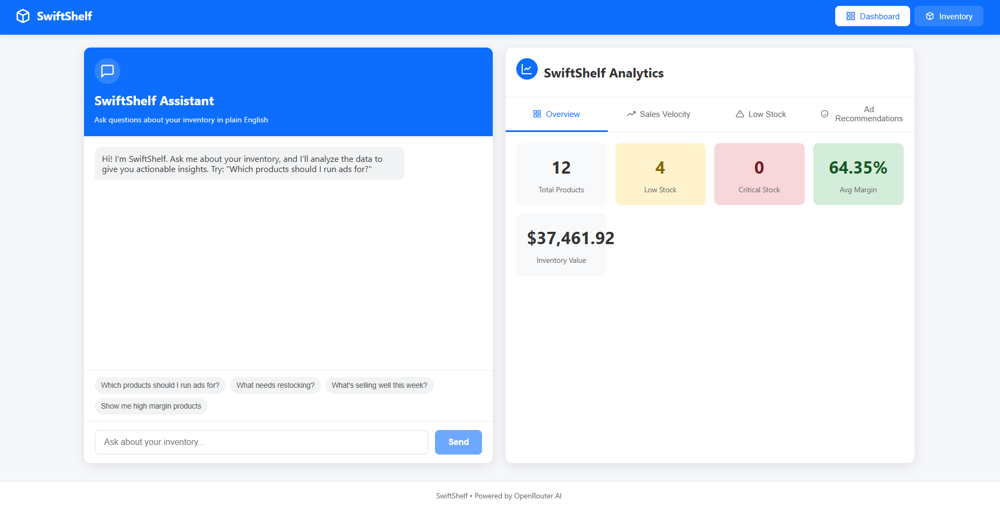
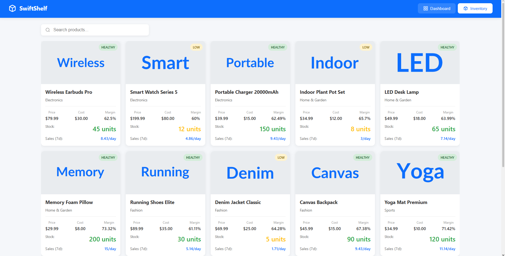
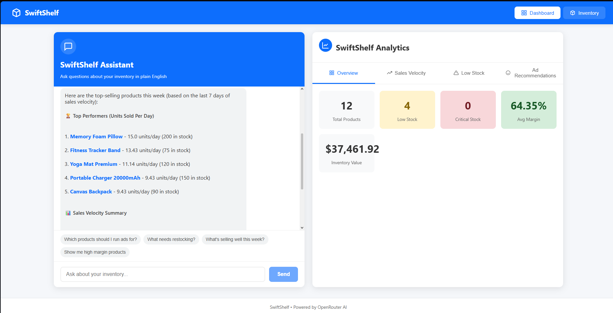

# SwiftShelf

AI-Driven Inventory & Trend Predictor

## Setup



### Backend
```bash
# Install dependencies (if not installed)
pip install fastapi uvicorn pydantic python-dotenv httpx

# Run the backend
python backend/main.py
```

### Frontend
```bash
cd frontend
npm install
npm run dev
```

## Features

- **Dashboard**: AI Assistant chat + Analytics side by side
- **Inventory**: Product grid with images, search, and stock status
- **AI Queries**: Ask natural language questions about your inventory




## API Endpoints

| Method | Endpoint | Description |
|--------|----------|-------------|
| POST | `/api/query` | Natural language query |
| GET | `/api/inventory` | All products |
| GET | `/api/inventory/{id}` | Single product |
| GET | `/api/analytics/summary` | Inventory summary |
| GET | `/api/analytics/low-stock` | Low stock items |
| GET | `/api/analytics/sales-velocity` | Sales ranking |
| GET | `/api/analytics/recommendations` | Ad recommendations |

## Example Queries

- "Which products should I run ads for?"
- "What needs restocking?"
- "What's selling well?"
- "Show high margin products"

## Images

Add product images to `backend/static/images/` directory.
Image filenames should match the `image_url` in mock_db.py:
- `/images/wireless-budspro.jpg`
- `/images/Smart Watch Series 5.jpg`
- `/images/Portable Charger 20000mAh.jpg`

## Configuration

Edit `.env` to add your OpenRouter API key:
```
OPENROUTER_API_KEY=your_api_key_here
```